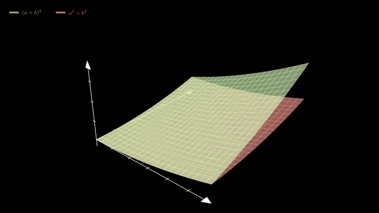
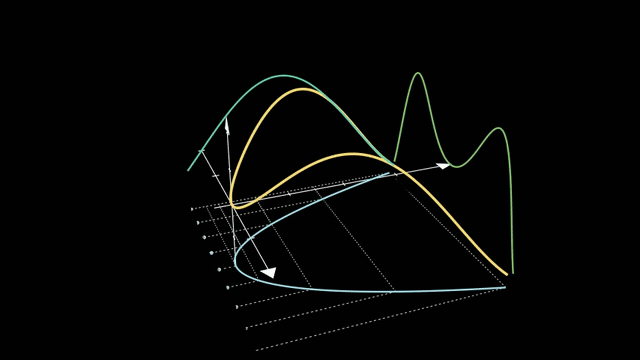
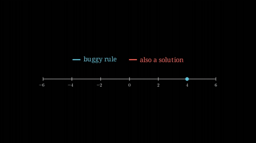

<div align="center">

# Astray

**Finds where your math reasoning went astray — then shows you.**

Most tools tell a student the answer is wrong. Astray finds the exact step where
the reasoning left the correct path, names the false rule behind it, and builds
an animation of *that* misconception.

<br>



**`(a+b)² → a² + b²`** · the two rules as two surfaces, orbiting

</div>

The sheets **touch along the two axes** and separate everywhere else. That says
something a derivation cannot: the rule is exactly right whenever one term is
zero — which is why it feels right, because every case the student ever checked
was probably one of those — and the gap elsewhere is a solid object with a size.

<div align="center">



**`d/dx sin(x²) → cos(x²)`** · the hidden middle stage, given an axis

</div>

`sin(x²)` becomes one curve in space whose three shadows are its three stages:
`u = x²` on the floor, `sin(u)` up the wall, the answer on the back. Step evenly
along `x` and the steps in `u` come out unequal — and that spacing ratio **is**
the `2x` a dropped chain-rule factor leaves out. Seen, not asserted.

<div align="center">



**`x² = 16 → x = 4`** · deliberately flat

</div>

Not every error deserves a camera. This one is an *absence* — every line the
student wrote is true, and the mistake is a missing one. There is nothing to
cross out, so a second dot arriving where they had nothing is the whole argument.
A surface here would be spectacle with no content.

Every frame above came out of the real pipeline, from a student's wrong answer.
Nothing is hand-drawn; `scripts/make_readme_gifs.sh` cuts them straight out of
rendered sessions.

## How it works

A student submits a problem and their own attempt — typed, or photographed and
transcribed by a vision model. Then:

1. Astray solves the problem correctly, **independently** of the student's work.
2. It finds the **divergence index** — the first step where the two part.
3. It names the **false rule** as a rewrite (`(a+b)^2 -> a^2 + b^2`), not a vague
   topic label.
4. It emits a SymPy check that would **falsify its own diagnosis**, runs it in a
   sandbox, and overwrites its confidence with the measured result. The model
   does not get to certify itself.
5. It canonicalizes the rule against a growing taxonomy, so the same error made
   with different letters lands on the same entry — which is what makes
   `2 other students made this error` true rather than decorative.

When the work is already correct, Astray says so and stops. Inventing an error
the student did not make is treated as exactly as bad as missing a real one.

Then the animation is planned, written, validated, rendered and narrated — and
the tutor chat cites moments in it by timestamp, landing on a frame that exists.

## The pipeline is Math-To-Manim's, with a diagnosis in front

The reasoning chain is
[Math-To-Manim](https://github.com/HarleyCoops/Math-To-Manim)'s reverse knowledge
tree, stage for stage. Upstream expands a short question into a teaching plan and
then into a scene; Astray does the same, having first worked out what this
particular student got wrong.

| Math-To-Manim | Astray | Artifact |
|---|---|---|
| — | `s0_ingest`, `s1_diagnose` | the falsifiable diagnosis |
| `IntentAgent` | `s2_intent` | `IntentAnalysis` |
| `PrerequisiteGraphAgent` | `s3_prereq` | `PrerequisiteGraph` |
| `CurriculumAgent` | `s4_curriculum` | `CurriculumPlan` |
| `MathAgent` | `s5_math` | `MathContent` |
| `StoryboardAgent` | `s6_visual` | `Storyboard` |
| `SceneSpecAgent` + `ManimCodeAgent` | `s7_scene` | `SceneCode` |
| `StaticReviewAgent` | `s8_validate` | `ValidationReport` |
| `RenderAgent` | `server/render/runner.py` | `RenderResult` |
| `ManimCodeAgent.repair()` | `server/render/repair.py` | a bounded repair loop |

Every stage is a typed Pydantic artifact persisted with its own token count and
cost — upstream's "keep LLM output reviewable by emitting intermediate artifacts
before code", made durable rather than written to a run directory.

Three things are ours:

- The chain starts from a **diagnosis** rather than a question, so every later
  stage is told what this student believes, not what the topic is.
- Scene code runs in a **sandboxed container behind an AST allow-list**, because
  the chain begins with untrusted student text.
- The storyboard's beats are a **grounding contract the validator enforces**, so
  a chat citation seeks to a moment that actually exists.

## What makes it hold up

**The diagnosis is falsifiable.** Every diagnosis ships a SymPy expression whose
truth value would disprove it, run deterministically in a killable subprocess. A
check that cannot fail is rejected as vacuous — a tautology would launder an
unchecked claim into a certified one.

**Generated code is untrusted, twice.** An AST allow-list *and* a
`--network=none`, read-only, non-root container with memory, CPU and PID caps.
Neither layer is trusted alone. If codegen fails twice, a deterministic renderer
builds the same beats with no model-authored code at all.

**Student text is untrusted.** Submissions are wrapped in per-request nonce
delimiters in every prompt. A student can write "ignore your instructions" in
their working without it becoming one.

**The grounding is enforced, not hoped for.** `s6` plans beats, `s7` must wrap
each in `with beat(self, "bN")`, `s8` fails the render if any is missing or
computed at runtime, and the container measures every beat's real start and end
from the renderer clock.

**Narration is written after the render, never before.** Only then are the beat
durations *measured*, and each becomes a word budget the line has to fit. A
script written from the storyboard would be guessing, and narration that guesses
talks over the next visual.

The failures behind each of these — and the ones that cost a render before they
were fixed — are in **[docs/DESIGN.md](docs/DESIGN.md)**.

## Running it

Requires Python 3.12 and [uv](https://docs.astral.sh/uv/).

```bash
uv sync
cp server/.env.example server/.env   # then add your DeepSeek key
uv run uvicorn server.app:create_app --factory --port 8000
```

`FAKE_LLM=1` runs the whole chain against canned responses — no network, no cost.
`RENDER_ENABLED=0` plans animations without running containers; beats still exist,
so chat stays grounded by title. Rendering itself needs Docker and
`manimcommunity/manim:stable`.

### API

| Method | Path | Purpose |
|---|---|---|
| `POST` | `/api/sessions` | Create a session from typed problem + work |
| `POST` | `/api/sessions/{id}/photo` | Transcribe handwritten work |
| `PUT` | `/api/sessions/{id}/submission` | Confirm the transcription before diagnosis |
| `GET` | `/api/sessions/{id}/stream` | SSE: diagnosis, then s2–s8 and the render |
| `GET` | `/api/sessions/{id}/beats` | Beat rail: plan plus measured timings |
| `GET` | `/media/{id}/video.mp4` | The rendered animation (range requests) |
| `POST` | `/api/sessions/{id}/chat` | Grounded reply citing `[beat:bN]` |
| `GET` | `/api/insights` | Misconception frequency and personal history |

`/stream` claims a session with a compare-and-swap, so concurrent connections
cannot double-bill a run; reconnecting to a finished session replays the stored
result rather than re-running it.

## Development

```bash
uv run pytest          # 597 tests; no network and no Docker — both are mocked
uv run ruff check . && uv run ruff format --check .
```

The interesting failures here are *visual*, and the primitives import `manim`,
which exists only inside the render image — so three scripts cover what a test
cannot reach:

```bash
uv run python scripts/check_primitives.py            # every primitive, one frame each
uv run python scripts/check_primitives.py --pass space   # just the 3D ones
uv run python scripts/run_session.py --preset binomial   # a whole session, real calls
```

`check_primitives.py` deliberately includes the abuse the live pipeline produced
as well as the correct usage: a Mobject where a string belongs, a function with a
pole inside the plot window, a label too wide for its cell. Each cost a render or
a frame before it was handled.

```bash
uv run python -m evals.diagnosis.run   # 20 labelled cases against the real model
```

Rule match is **not** currently a trustworthy gate — the scorer rejects
substantively correct diagnoses on notation, and that number is left honest
rather than tuned. Topic match and verification rate are reliable.

## Honest limits

- The wake phrase is Web Speech API inside the page. Close the tab and it stops;
  background the tab and Chrome's timer throttling stretches the restart gaps.
  The state machine is tested against a stubbed recognizer — **the acoustic path
  has never been verified against a real microphone.**
- Wake detection is edit distance on a general transcript, not a trained keyword
  model, so it misses and misfires more than a real assistant would.
- Idle listening streams audio to Google's servers. That is why muting is a
  first-class control rather than a buried preference.
- Session history is keyed by a random handle in `localStorage`. No accounts —
  which means the history follows the browser profile, not the person.

## Layout

```
server/charter/     s2–s8 stage prompts and typed contracts
server/render/      primitives, AST validator, container runner, repair loop
server/audio/       narration: budgeting, spoken-maths, phonemes, muxing
web/                vanilla JS client — no build step
docs/DESIGN.md      why it is the way it is
DEMO.md             the prepared sessions, and what is live in them
```
